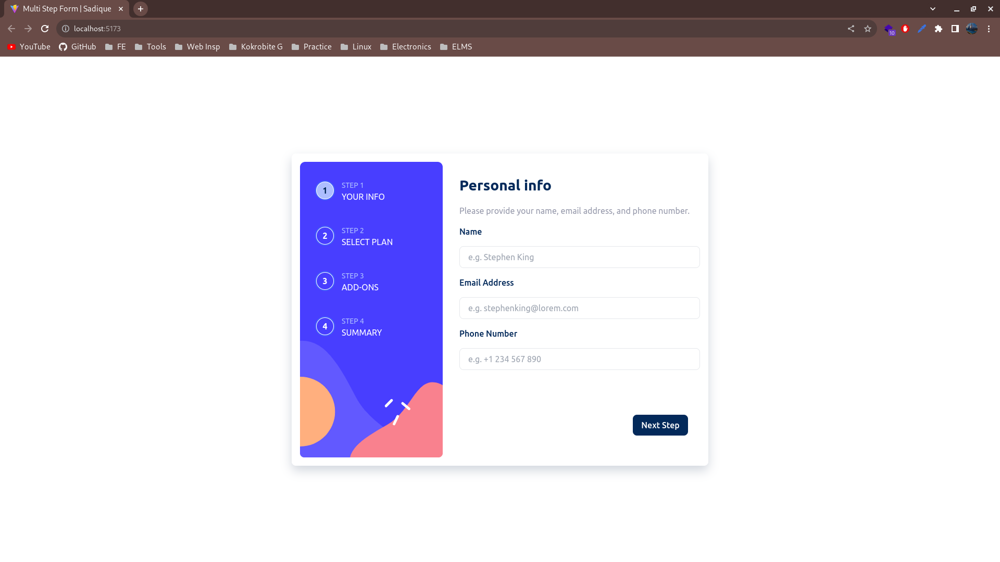
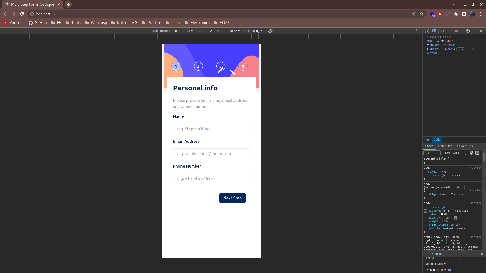

## Multi-step form

### Deliverables

Users are be able to:

- Complete each step of the sequence
- Go back to a previous step to update their selections
- See a summary of their selections on the final step and confirm their order
- View the optimal layout for the interface depending on their device's screen size
- See hover and focus states for all interactive elements on the page
- Receive form validation messages if:
  - A field has been missed
  - The email address is not formatted correctly
  - A step is submitted, but no selection has been made

### Screenshots

### Links

- #### [Live site URL](https://multi-stepform-frontend-mentor.vercel.app/)

### Built with

- [React](https://reactjs.org/) - JS library
- TailwindCSS
- Flexbox
- CSS Grid
- Mobile-first workflow
